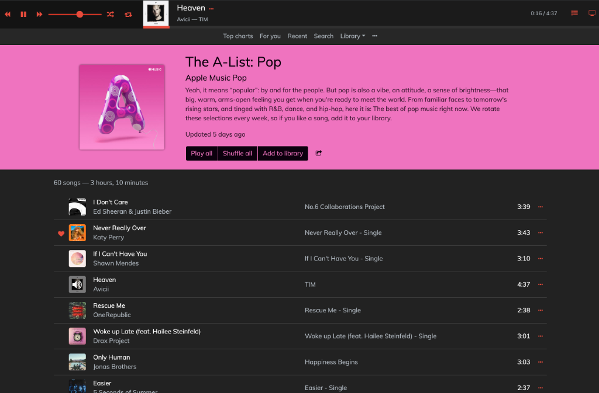
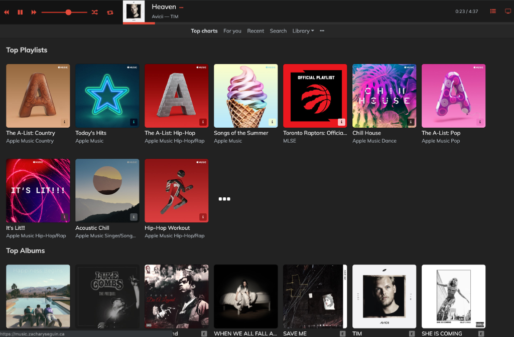
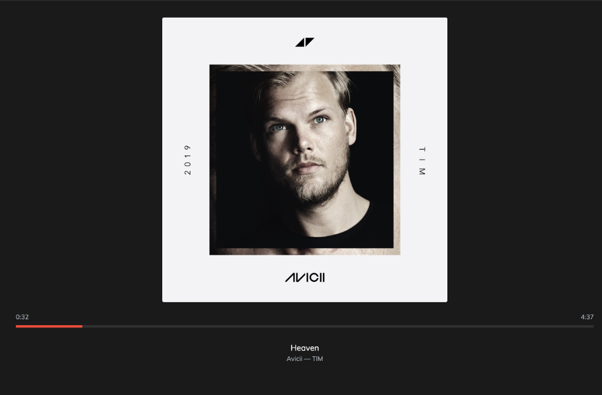

# Apple Music Web Player

[music.zacharyseguin.ca](https://music.zacharyseguin.ca)

This is a web player for Apple Music using [MusicKit JS](https://developer.apple.com/documentation/musickitjs).

> Apple and Apple Music are trademarks of Apple Inc., registered in the U.S. and other countries.

## Features

\* denotes features only available when signed into Apple Music.

- Access to the entire Apple Music library
- Access to your personal Music Library*

### Playback

- Full track playback*
    - Control volume, shuffle and repeat modes
- Add songs to the playback queue
- Full screen player
- Use keyboard media controls to play/pause, skip track and return to previous track (browser must support Media Session)
- Notifications when the track changes (can be disabled if not desired)

### Discovery

- Top charts
- For you*
- Recent*
- Search both Apple Music and your Library*

### Library management

- Add playlists, albums and songs to your library*
- Add songs to playlists (new or existing)*
- Love and dislike songs*

## Screenshots







---

## Development

This web player is written using [Vue.js](https://vuejs.org).

### Getting started

```sh
git clone https://github.com/zachomedia/apple-music-webplayer.git
cd apple-music-webplayer

# Install dependencies
npm install

# Add the private settings
cp src/private.js.sample src/private.js

# Add your Developer Token to src/private.js
#  To generate one, see below.

# To run a local development instance
npm run serve

# To build the app (to dist folder)
npm run build
```

### Generating an Apple Music Developer token

[Apple's official documentation](https://developer.apple.com/documentation/applemusicapi/getting_keys_and_creating_tokens) provides a base, and then you can visit [Creating an Apple Music API Token](https://medium.com/@leemartin/creating-an-apple-music-api-token-e0e5067e4281) for a great guide on how to generate the token.
